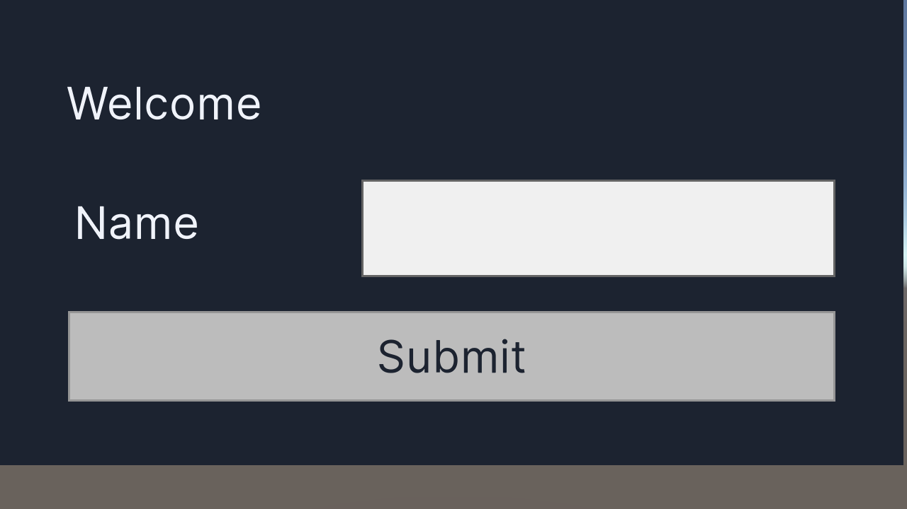
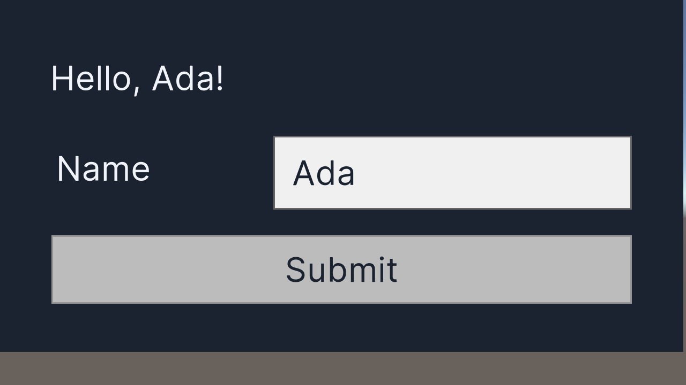
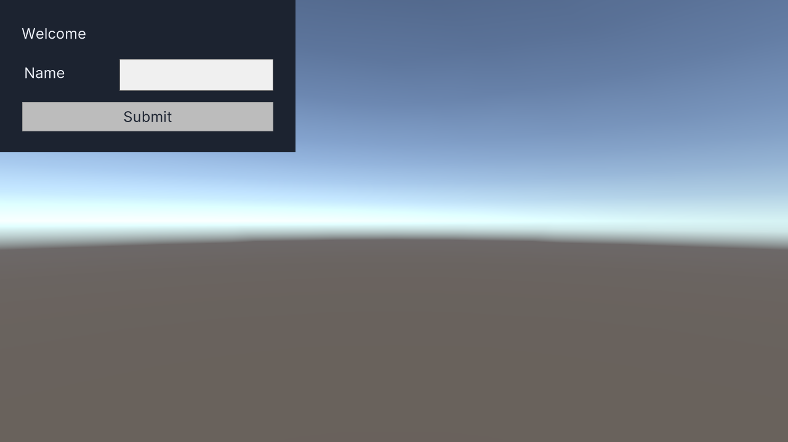
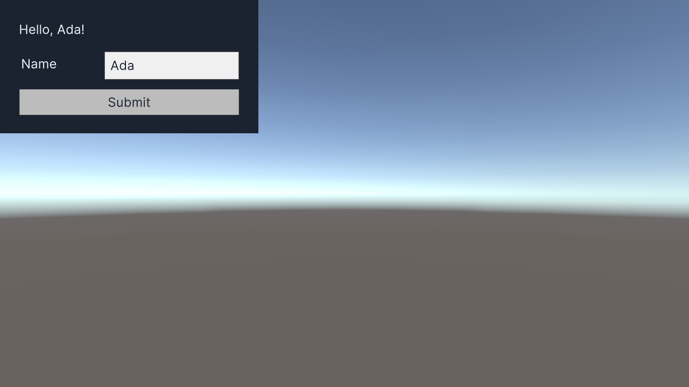

# Issue #377 — UI Toolkit construction skill

## Scope and acceptance

Adds independently authored `unity-ui-toolkit-build`: UXML/USS, PanelSettings,
UIDocument, a C# callback, saved scene, Play-mode UI interactions and Game-frame
captures. No Rust CLI or Unity bridge implementation was changed.

| Criterion | Evidence |
| --- | --- |
| AC-1 | Canonical skill, Claude/Codex symlinks, reciprocal sibling boundaries, inventory; 18 skills / 0 lint violations. |
| AC-2 | Real Claude Code construction and verification on both required Editors; source assets, operation logs and before/after PNGs below. |
| AC-3 | Added positive/boundary cases UI377-01–08: 8/8, all four routing metrics 100%. Existing full-suite limitation is separately reported below. |
| AC-4 | Author review: no official `unity-agent-plugin` skill text or code was read or reused. Examples were written from this repository's tool contracts and validated in the Editor. |
| AC-5 | Requirements, design and tasks recorded in [parent SPEC #160](https://github.com/akiojin/unity-cli/issues/160#issuecomment-5925452540). |

Launch mode: autonomous (Issue Monitor).
User Verification Result: n/a (autonomous).
Agent Visual Check: pass — both versions, both frames; this is not human confirmation.

## Real Editor scenarios

Host: macOS Apple Silicon; CLI/bridge 0.16.0; Claude Code `claude-opus-5-5`.
Dedicated projects were copied from test fixtures, with this checkout's bridge.
The sessions loaded this checkout's plugin and invoked
`/unity-cli:unity-ui-toolkit-build`. No official Unity plugin was loaded.

The construction sessions created `Assets/Scenes/Generated/E2E/ToolkitDemo.unity`,
`Assets/UI/ToolkitDemo/{Screen.uxml,Screen.uss,Theme.tss,Panel.asset}` and
`Assets/Scripts/ToolkitDemoBinding.cs`. Serialized assets were created through
Editor APIs, and the C# script through `create_csharp_file`. Both versions
compiled with zero errors, saved/reloaded the scene and retained the document,
panel, theme and binding. Existing sample scenes were preserved.

| Editor | Construction session | Final verification session | Endpoint |
| --- | --- | --- | --- |
| 6000.3.25f1 | `270563f2-39c5-40f2-97eb-637896fe0b6a` | See verification transcript | 127.0.0.1:6517 |
| 2022.3.62f3 | `dbf39541-89e2-4d0f-b792-7bee9c715b2d` | See verification transcript | 127.0.0.1:6518 |

Final sessions ran after the USS contrast correction. They loaded the saved
scene, entered Play, found `uitk:/ToolkitDemo#status`, `#player-name`, and `#submit`,
asserted `Welcome`, set/read back `Ada`, clicked Submit, and asserted
`Hello, Ada!`. They captured new Game frames with unique request IDs and output
paths, inspected the images and resolved text colors, restored
`Application.runInBackground`, exited Play and confirmed `isDirty:false`.

### Unity 6000.3.25f1

- [UXML](issue-377/6000.3.25f1/Screen.uxml), [USS](issue-377/6000.3.25f1/Screen.uss), [binding](issue-377/6000.3.25f1/ToolkitDemoBinding.cs).
- [Construction transcript](issue-377/6000.3.25f1/construction.json), [verification transcript](issue-377/6000.3.25f1/verification.json), [exact UI operation log](issue-377/6000.3.25f1/accepted-ui.log).




### Unity 2022.3.62f3

- [UXML](issue-377/2022.3.62f3/Screen.uxml), [USS](issue-377/2022.3.62f3/Screen.uss), [binding](issue-377/2022.3.62f3/ToolkitDemoBinding.cs).
- [Construction transcript](issue-377/2022.3.62f3/construction.json), [verification transcript](issue-377/2022.3.62f3/verification.json), [exact UI operation log](issue-377/2022.3.62f3/accepted-ui.log).




The PNGs are 1280×720. The Editors use different Game-view scale settings, so
the form's pixel size differs; both images include the whole form and legible
input/button text. Each `evidence.json` records artifact hashes and hashes of
the original local JSONL streams. Curated JSON preserves text, tool inputs and
tool results; reasoning signatures and duplicate embedded images are omitted.
Original streams and Editor logs remain in `/tmp/issue377-evidence/<version>/`.

## Findings and boundaries

- `create_csharp_file` with `refresh:true` / `waitForCompile:true` saved the file
  and then panicked in the nested Tokio runtime. The sessions verified the
  saved file and recovered with separate `refresh_assets` and
  `get_compilation_state` calls. The skill uses that separation; the CLI fix is
  [#420](https://github.com/akiojin/unity-cli/issues/420).
- `capture_screenshot(captureMode:game,includeUI:true)` returned camera-only
  skybox images; those images were rejected. `window` capture is unsupported.
  The accepted images use the existing Editor eval tool to call
  `UnityEngine.ScreenCapture.CaptureScreenshot`, focus Game view and wait for a
  later frame/file. This uses Unity's Game-frame API, not OS capture, a mocked
  renderer, or a new bridge backend. The dedicated capture defect is
  [#422](https://github.com/akiojin/unity-cli/issues/422); the PM approved the
  existing eval/API workaround for this skill.
- Initial connection delays were Input System setup dialogs. The controlling
  agent inspected/dismissed only the dedicated Editor's prompt. A first attempt
  on port 6493 detected another project and stopped before mutation; subsequent
  runs verified project identity on 6517/6518.
- Final console logs include Unity renderer messages about memoryless depth
  surface load/store actions. They are retained, not treated as a clean console.
  No binding-script exceptions/asserts or compilation errors were observed.
  Diagnostic eval attempts using an unqualified `Q()` extension failed before
  execution; corrected checks used `UQueryExtensions.Q` explicitly. CS0162
  warnings from eval's generated wrapper are also retained.
  Independent final `get_compilation_state` reads report `errorCount:0`,
  `consoleErrorCount:0` and `consoleWarningCount:2` on both Editors; the
  `read_console` severity labels differ. The raw readings are preserved in each
  version's `independent-state.json`, alongside clean scene and Edit-mode state.

## Routing and checks

The blind routing runner used the unchanged catalog/rules from
`scripts/skill-eval/run-codex-routing.py` and supplied only IDs/prompts to Claude
Code, never expected answers. Before the skill existed, both new construction
prompts routed to `unity-development-loop` / `unity-csharp-edit` (RED). After
addition, all 8 new cases passed. Raw model keys `skill`/`skills` were normalized
to `predicted_skills` without changing any selection.

The [full 178-case result](issue-377/routing-full-summary.json) is **FAIL**:
top1 98.31%, top2 99.44%, tool 74.16%, payload 75.28%. Legacy tool hints are
missing from the catalog (for example `get_command_stats`, `delete_gameobject`,
`build_index`); repair belongs to [#419](https://github.com/akiojin/unity-cli/issues/419).
No existing benchmark expectations were edited, and full-suite success is not
claimed here. New UI Toolkit cases pass in both the focused and full runs.
The PM's Board ruling `966339b8-68cc-479a-9428-141cffbaf01d` accepts the added
8/8 cases as satisfying AC-3, with the full-suite repair remaining in #419.

```bash
cargo run -- skills lint --severity error
cargo test --test skills_install -- --test-threads=1
python3 -m unittest discover -s tests/scripts -p test_skill_routing.py -v
scripts/skill-eval/llm-routing-eval.sh \
  --benchmark docs/verification/issue-377/routing-cases.jsonl \
  --predictions docs/verification/issue-377/routing-predictions.jsonl \
  --model claude-opus-5-5
python3 docs/verification/issue-377/check-evidence.py
cargo fmt --all -- --check
```

The artifact check verifies committed evidence integrity and required scenario
outputs; it does not rerun Unity. To repeat the actual scenario, use an isolated
project with this checkout's bridge and plugin, verify its ping project path,
then invoke `/unity-cli:unity-ui-toolkit-build` in a fresh authenticated Claude
Code session with the exact Editor/port and an unused scene/asset/capture path.
Follow `references/construction.md`, preserve command responses, inspect both
PNGs, and restore Edit Mode. Do not reuse an eval request ID or overwrite a
previous capture when establishing fresh evidence.
